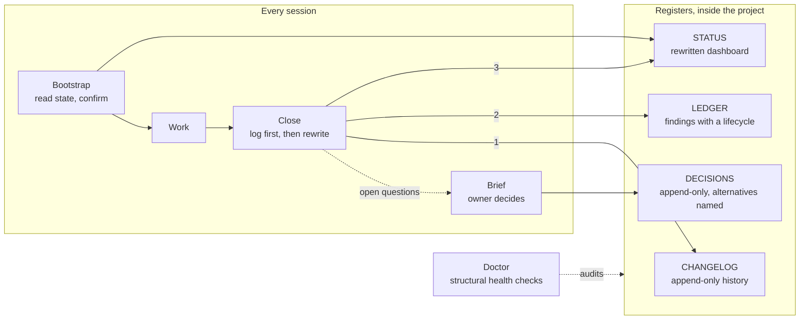

# project-docs-protocol

**A continuity system for AI-assisted projects.** Any AI model, in any app, on any machine, picks up a project exactly where the last session left off — what is in progress, what was decided and why, what is blocked, what comes next.

Every AI session starts cold. Built-in memory belongs to one tool and one account, so it doesn't follow the project to another model, another app, another machine or another person. The result is a project re-explained at the start of every session, or worse, guessed. This system keeps the project's state inside the project, and is built to keep it accurate through long-running work: model switches, interrupted runs and handoffs.

## How it works



Four mechanisms work together.

**Registers, each with one job and one rule.**

| Register | Job | Rule |
|---|---|---|
| `STATUS.md` | The live dashboard: phase, in flight, blocked, next, open questions | Rewritten at every close, never appended to; kept under ~60 lines |
| `CHANGELOG.md` | What happened and why | Append-only; written first at every close |
| `DECISIONS.md` | Choices made, with the alternatives rejected | Append-only; a correction is a new entry, never an edit |
| `LEDGER.md` *(optional)* | Findings and checks too many for STATUS | One row per item, six lifecycle states, closed rows archived with evidence |
| `README.md` | How any agent uses the registers | The entry point for any model or app |

**Rituals that run the session.** *Bootstrap* reads state before any work is proposed. *Close* runs after each meaningful piece of work in a fixed order. *Brief* turns open questions into decisions the owner picks explicitly, recorded with the alternatives they rejected. *Install* sets a project up in one exchange. *Doctor* checks the whole register.

**Integrity by design.** The write order is the safety mechanism: the history is written before the dashboard, so an interrupted session can lose a STATUS update but never the record of what happened. History registers only grow, so they can't be silently rewritten. STATUS has a size ceiling, because a growing dashboard is history leaking into it. Decisions name the alternatives they rejected, so a later session builds on them instead of re-arguing them.

**Automated checks.** Doctor is a read-only health check with up to 39 checks, depending on what a project uses: wiring, register shape, write discipline, decision IDs, and the ledger's schema, lifecycle and evidence rules. Exit codes separate advisory drift from a broken property. It needs only Python's standard library.

## Extensions, adopted when a project needs them

- **Findings ledger and reviewed migration.** When a project's open findings outgrow STATUS, they move into a ledger with stable IDs, a six-state lifecycle and an evidence requirement for closing. A reviewed migration moves them across with a recovery journal, so an interrupted migration can be replayed without losing or duplicating a row.
- **Research companion.** Sources, notes, open questions and syntheses with stable IDs and recorded provenance. Its checker fails closed on broken links, missing provenance and ambiguous IDs, so the trail from a claim back to its source passage stays intact.
- **Architect companion.** For larger changes: each stage gets a frozen scope and acceptance criteria, an independent reviewer checks the exact version against them, and the handoff carries the evidence and the reviewer's verdicts.
- **Skill registry.** Records which skills a project uses, who authorised each one, and a fingerprint of the reviewed version. A skill that has changed since review is treated as unavailable until it is reviewed again; nothing in the registry grants permission by itself.

## Works with any model, app or machine

Plain text was a deliberate choice: it is the one format every model can read and write, every app can open, and every repository carries to a new machine.

- **Apps that load `AGENTS.md` or `CLAUDE.md` at startup** run the system on their own. A short instruction block tells the agent to bootstrap before doing anything and to close after each piece of work.
- **Any app that can read files** starts with one sentence: *"Read `docs/README.md` and follow its session bootstrap."*
- **A plain chat window** still works: paste STATUS and the latest CHANGELOG entries in at the start, and paste the new entry and the rewritten STATUS back out at the end.

## Verified, not asserted

- **Audited across 25 projects** before going public. Projects whose instructions carried the block rewrote STATUS as designed (churn 0.67–0.83); projects without it accreted history (0.01–0.16). The largest CHANGELOG had 11,369 lines added and 1 deleted, with nothing enforcing it. The figures are in `docs/EVIDENCE.md`; the churn result is an association in a small, mixed sample, not proof of cause.
- **567 automated tests** across the core and both companions, standard library only.
- **Independently reviewed.** Since v0.3.0 every release has been reviewed by a separate model session, and v0.4.1 was held until its re-review passed.
- **Tested with fresh sessions.** Three new agent sessions, each given an ordinary request with no hints, found the skill registry on their own. One used the skill the owner had authorised, one asked before adopting a skill that wasn't authorised, and one refused a skill that had changed since review and used its fallback.

Everything measured so far was run in Claude Code and Codex. Nothing in the system depends on either, but other apps and models haven't been measured yet.

## Install

**With nothing installed.** Copy `README.md`, `STATUS.md`, `CHANGELOG.md` and `DECISIONS.md` from `templates/` into your project's `docs/` folder, fill in STATUS, and add the instruction block from *Step 2* of `SKILL.md` to `AGENTS.md` (and `CLAUDE.md` if you use Claude Code). That is a complete installation.

**As a skill**, for Claude Code and Codex, which then run Install, Close, Doctor and Brief for you:

```bash
git clone https://github.com/anthonylim9913/project-docs-protocol.git ~/.claude/skills/project-docs-protocol
ln -s ~/.claude/skills/project-docs-protocol ~/.codex/skills/project-docs-protocol   # Codex
```

Then, in any project, ask for "set up project docs". The skill recognises a project already using the system by its three registers plus either the instruction block or the install note in the docs README; the three filenames alone are not enough, because other conventions use them too.

## Files

- **`SKILL.md`** — the full operating instructions: all five modes, the extensions, and which check to run when.
- **`templates/`** — starter files for every register and extension.
- **`scripts/`** — Doctor, the reviewed ledger migration, and the skill-registry validator.
- **`staging/`** — the research and Architect companions.
- **`tests/`** — the test suites: `python3 -B -m unittest discover -v`.
- **`docs/`** — this project's own registers. It runs the system it ships, so its STATUS, CHANGELOG, DECISIONS and LEDGER are a working example.

## Status

Built for my own multi-session projects, then audited, reviewed and tested before going public. Sharing it in case it is useful to others. Issues and pull requests are welcome, but treat it as a personal tool made public rather than a maintained product.

## License

[MIT](LICENSE)
